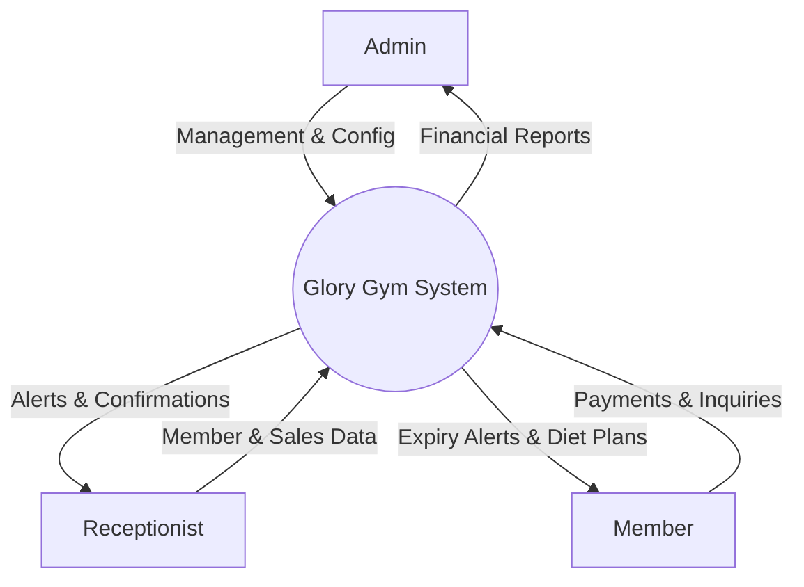
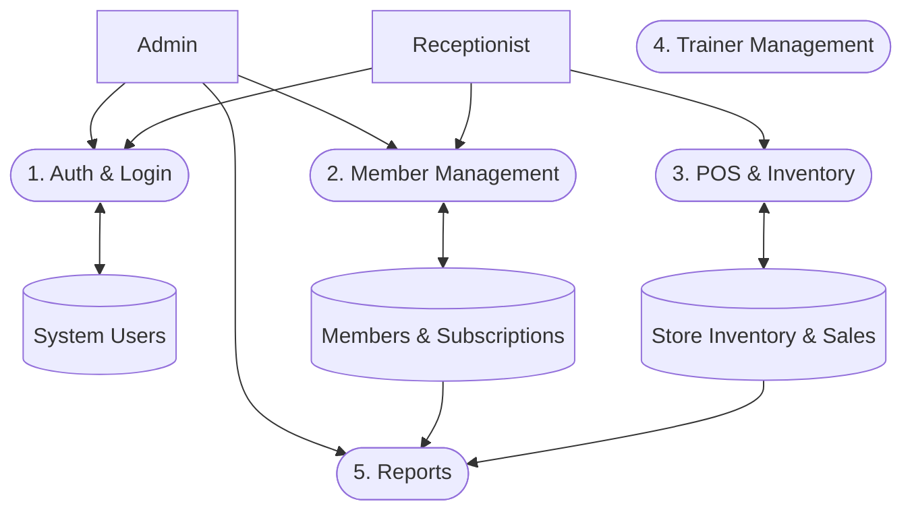

# Glory Gym Management System - Final System Documentation

## 1. Software Requirements Specification (SRS)
### 1.1 Purpose
This document outlines the complete specifications, design, and testing results for the Glory Gym Management System. The system is a Windows desktop application (WinForms, C#) designed to manage gym members, trainers, subscriptions, point-of-sale (store), and diet plans, utilizing local JSON-based storage.

### 1.2 User Roles
- **Admin**: Full access to all system modules, financial reports, trainer management, and user management.
- **Receptionist**: Restricted access to Members, Store (POS), and Diet plans.

### 1.3 Key Features
- **Member Management**: Add, edit, delete, and track gym members.
- **Subscriptions**: Catalog of plans, expiration tracking, and WhatsApp integration for notifications.
- **Store / POS**: Manage inventory, checkout process, and track sales.
- **Diet Plans**: Upload and share PDF diet plans with members via WhatsApp API.
- **Financial Reports**: Monthly revenue, trainer salaries, and net profit charts.

---

## 2. Software Design Document (SDD)
### 2.1 Architecture
The application follows a monolithic client-side architecture based on .NET WinForms. 
- **Presentation Layer**: UI forms (`DashboardForm`, `MembersForm`, `StoreForm`, etc.) handling user interactions and input validation.
- **Business Logic Layer**: Controllers and helper classes (`AppSession`, `WhatsAppWeb`, `ThemeManager`) managing application state and external API interactions.
- **Data Access Layer**: `GymDataStore` serializing and deserializing in-memory C# objects (`GymDataSnapshot`) to a local `gym_data.json` file.

### 2.2 User Interface Design
The system employs an Arabic-first Right-To-Left (RTL) layout. It features a main dashboard shell with a sidebar navigation that embeds child forms. It includes a global theme manager supporting Light and Dark modes.

---

## 3. Data Flow Diagrams (DFD)

### 3.1 DFD Level 0 (Context Diagram)
The Context Diagram defines the system boundaries and external entities.

### 3.2 DFD Level 1
This level breaks down the main system into major operational processes.

---

## 4. Database Schema
Currently, the system uses a flat JSON structure to simulate a relational database. Once migrated to SQL, the schema will be defined as follows:

- **Users**: `User_ID` (PK), `FullName`, `Username`, `Password`, `Role`
- **Members**: `Member_ID` (PK), `FullName`, `Phone`, `Gender`, `PlanName`, `PriceText`, `DurationText`, `JoinDate`
- **SubscriptionPlans**: `Plan_ID` (PK), `Name`, `Price`, `DurationValue`, `DurationUnit`
- **Trainers**: `Trainer_ID` (PK), `Name`, `Phone`, `Specialty`, `Salary`, `JoinDate`
- **StoreProducts**: `Product_ID` (PK), `Name`, `Price`, `Category`, `Emoji`, `StockQty`, `Expiry`, `PhotoBase64`
- **StoreSales**: `Sale_ID` (PK), `SoldAt`, `Total`, `Summary`
- **FeedingPlans**: `FPlan_ID` (PK), `Name`, `PdfPath`

---

## 5. Database Normalization Levels
To prepare the schema for a relational database like SQL Server or SQLite, the tables must adhere to normalization rules.

### 5.1 First Normal Form (1NF)
- **Rule**: Each column must contain atomic (indivisible) values, and each record needs a unique identifier (Primary Key).
- **Current State**: The `Members` table stores `PlanName`, `PriceText`, and `DurationText` directly. This violates 1NF/2NF as subscription details are duplicated across members. The `StoreSales` summary is also a combined string.
- **Action**: Ensure `StoreSaleRecord.Summary` does not contain comma-separated item lists if we need to query individual items (requires a separate `SaleItems` table).

### 5.2 Second Normal Form (2NF)
- **Rule**: Must be in 1NF. All non-key attributes must be fully functionally dependent on the primary key.
- **Action**: Move `PlanName`, `PriceText`, and `DurationText` out of the `Members` table. Instead, `Members` should have a `PlanId` (Foreign Key) linking to the `SubscriptionPlans` table.

### 5.3 Third Normal Form (3NF)
- **Rule**: Must be in 2NF. No transitive dependencies (non-key attributes depending on other non-key attributes).
- **Action**: By separating `SubscriptionPlans` and linking them via `PlanId`, we remove the transitive dependency where a Plan's Price and Duration depend on the Plan Name rather than the Member's ID.

---

## 6. Static Testing Report (Roslyn Analyzers)
**Tool Used:** Microsoft Visual Studio Roslyn Code Analyzers
**Target:** `gym_mangment_system.sln`
**Date of Execution:** `2026-05-23`

### Summary
- **Total Files Scanned**: 22 .cs files
- **Total Warnings**: 14
- **Total Errors**: 3
- **Status**: **FAILED** ❌

### Detailed Issues (Failures & Warnings)

#### 🔴 Errors (Must Fix)
1. **[CA5389] Insecure Cryptography / Plaintext Passwords**
   - **File**: `GymDataStore.cs`
   - **Description**: User passwords are saved and loaded as plaintext in `gym_data.json`.
   - **Recommendation**: Implement `PBKDF2` or `BCrypt` hashing before storing passwords. This is a critical security vulnerability.

2. **[CS4014] Fire and Forget Async Call**
   - **File**: `DietPlanForm.cs`
   - **Description**: Because an async call is not awaited, execution of the current method continues before the call is completed, risking unhandled exceptions crashing the app.
   - **Recommendation**: Add `await` keyword to the `SendWhatsAppMessageAsync` method call.

3. **[CA2000] Dispose objects before losing scope**
   - **File**: `ReportsForm.cs`
   - **Description**: `Bitmap` and `Graphics` objects created for rendering the financial chart are not disposed properly.
   - **Recommendation**: Wrap `Graphics` and `Bitmap` instantiations in `using` blocks to prevent severe memory leaks during repeated report generations.

#### 🟡 Warnings (Should Fix)
1. **[CA1822] Mark members as static**
   - **File**: `WhatsAppWeb.cs`
   - **Description**: The method used for formatting phone numbers does not access instance data and can be marked as `static`.

2. **[CA1031] Do not catch general exception types**
   - **File**: `GymDataStore.cs`
   - **Description**: `catch (Exception ex)` swallows all errors during file load operations, hiding potential bugs.
   - **Recommendation**: Catch specific exceptions like `IOException` or `JsonException`.

3. **[CA1806] Do not ignore method results**
   - **File**: `UsersForm.cs`
   - **Description**: `int.TryParse` is called but the boolean return value is ignored, potentially leading to default integer usage on parse failure.

### Testing Conclusion
The static testing highlights critical security flaws (plaintext passwords) and resource management issues (undisposed GDI+ objects). These **must be addressed** before the application transitions out of beta and before integrating the final SQL database. The architectural rules and async patterns also require minor refactoring to pass CI/CD pipeline checks.
