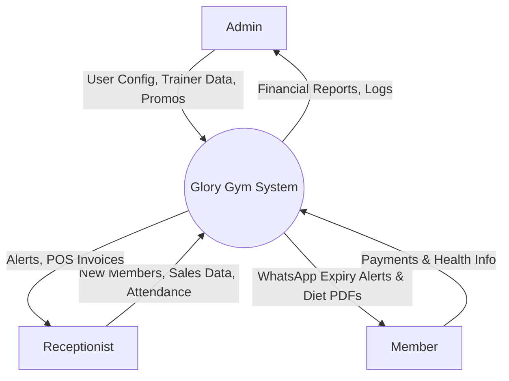
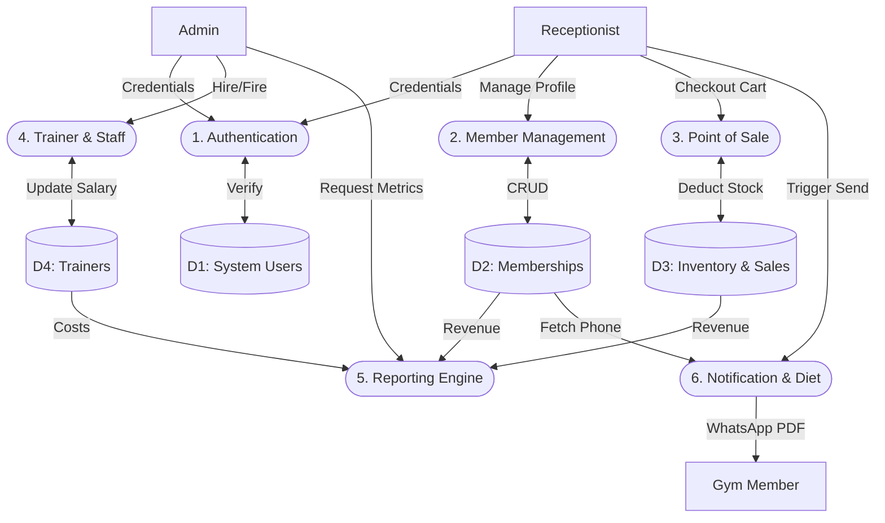

# Glory Gym Management System - Comprehensive System Documentation

## 1. Software Requirements Specification (SRS)

### 1.1 Purpose
This document provides a comprehensive and detailed specification, architecture design, and static analysis report for the Glory Gym Management System. The system is built as a Windows desktop application (WinForms, C#) designed to manage all operations of a modern gym, including memberships, subscriptions, trainers, point-of-sale (POS) store, and diet plans. 

### 1.2 User Classes and Roles
- **System Administrator (Admin)**: Has unrestricted access to all modules. Can view high-level financial reports, manage trainers, configure system settings, and add/remove users.
- **Receptionist**: Has operational access. Restricted to managing Members, conducting POS transactions (Store), and viewing/sending Diet plans. Cannot view financial reports or trainer salaries.

### 1.3 Detailed Functional Requirements (FR)
- **FR-AUTH**: The system shall provide a secure login screen. Authentication relies on local data validation.
- **FR-MEM**: The system shall allow users to Add, Edit, Delete, and Search members. Member data includes personal details and active subscription plans.
- **FR-SUB**: The system shall maintain a catalog of Subscription Plans (e.g., "1 Month VIP", "3 Months Basic") to be assigned to members.
- **FR-POS**: The system shall include a POS module where users can add items to a cart, calculate totals, and checkout, automatically deducting from inventory.
- **FR-DIET**: The system shall allow uploading PDF diet plans and sending them directly to members via the Qonvo WhatsApp API.
- **FR-FIN**: The system shall calculate monthly net profit by subtracting trainer salaries from the gross revenue (subscriptions + store sales).

### 1.4 Non-Functional Requirements (NFR)
- **Localization**: The application UI is completely Arabic-first with a Right-To-Left (RTL) layout.
- **Theming**: The system supports dynamic Light and Dark mode switching via the `ThemeManager`.
- **Storage**: Currently relies on a local JSON file (`gym_data.json`). Migration to SQL is planned.

---

## 2. Software Design Document (SDD)

### 2.1 Architectural Pattern
The application uses a **Monolithic WinForms Architecture**. It separates concerns logically into three implicit layers:
1. **Presentation Layer (UI)**: Contains all `.cs` Form classes (e.g., `DashboardForm`, `MembersForm`). Uses standard WinForms controls styled for modern aesthetics.
2. **Business Logic Layer (BLL)**: Contains managers like `AppSession` (tracks logged-in user state), `WhatsAppWeb` (handles URL formatting for messaging), and `ThemeManager` (handles global color palettes).
3. **Data Access Layer (DAL)**: `GymDataStore` is a static helper class responsible for serializing/deserializing the `GymDataSnapshot` object to the local `%LocalApplicationData%` directory.

### 2.2 Sub-System Components
- **`AppSession`**: A static context class that holds the current user's role and details.
- **`GymDataSnapshot`**: The root aggregate object that holds all collections (Members, Trainers, Users, etc.) in memory.
- **`IThemeAware`**: An interface implemented by all child forms to react when the user toggles the global theme in the dashboard.

---

## 3. Data Flow Diagrams (DFD)

### 3.1 DFD Level 0 (Context Diagram)
The Context Diagram shows the system as a single black box interacting with external entities.

### 3.2 DFD Level 1 (Process Breakdown)
Level 1 decomposes the main system into detailed sub-processes and data stores.

---

## 4. Target SQL Database Schema

When the system migrates from JSON to SQL, the following exact schema with data types is proposed:

| Table Name | Column Name | Data Type | Constraints | Description |
|------------|-------------|-----------|-------------|-------------|
| **Users** | `User_ID` | INT | PK, Identity | Unique user ID |
| | `FullName` | NVARCHAR(100) | NOT NULL | Display name |
| | `Username` | VARCHAR(50) | UNIQUE, NOT NULL | Login name |
| | `PasswordHash` | VARCHAR(255)| NOT NULL | Hashed password |
| | `Role` | VARCHAR(20) | NOT NULL | 'Admin' or 'Receptionist' |
| **SubscriptionPlans**| `Plan_ID` | INT | PK, Identity | Unique plan ID |
| | `Name` | NVARCHAR(100) | NOT NULL | e.g., "3 Months VIP" |
| | `Price` | DECIMAL(10,2)| NOT NULL | Cost of the plan |
| | `DurationDays` | INT | NOT NULL | Length of plan in days|
| **Members** | `Member_ID` | INT | PK, Identity | Unique member ID |
| | `FullName` | NVARCHAR(150) | NOT NULL | Member name |
| | `Phone` | VARCHAR(20) | NOT NULL | Contact number |
| | `Gender` | VARCHAR(10) | NOT NULL | 'Male' or 'Female' |
| | `Plan_ID` | INT | FK (SubscriptionPlans)| Active subscription plan|
| | `JoinDate` | DATETIME | NOT NULL | Date of registration |
| **Trainers** | `Trainer_ID` | INT | PK, Identity | Unique trainer ID |
| | `Name` | NVARCHAR(100) | NOT NULL | Trainer name |
| | `Phone` | VARCHAR(20) | NOT NULL | Contact number |
| | `Salary` | DECIMAL(10,2)| NOT NULL | Monthly salary |
| **StoreProducts** | `Product_ID` | INT | PK, Identity | Unique product ID |
| | `Name` | NVARCHAR(100) | NOT NULL | Product name |
| | `Price` | DECIMAL(10,2)| NOT NULL | Selling price |
| | `StockQty` | INT | NOT NULL | Current inventory level |
| **StoreSales** | `Sale_ID` | INT | PK, Identity | Unique receipt ID |
| | `SoldAt` | DATETIME | NOT NULL | Timestamp of sale |
| | `TotalAmount`| DECIMAL(10,2)| NOT NULL | Total cost of receipt |
| **SaleItems** | `Detail_ID` | INT | PK, Identity | Line item ID |
| | `Sale_ID` | INT | FK (StoreSales) | Link to receipt |
| | `Product_ID` | INT | FK (StoreProducts) | Link to product |
| | `Quantity` | INT | NOT NULL | Amount purchased |

---

## 5. Database Normalization Analysis

### 5.1 Step 1: First Normal Form (1NF)
**Goal**: Eliminate repeating groups and ensure atomic values.
**Current JSON Issue**: In `StoreSaleRecord`, the `Summary` field currently holds a comma-separated string of items purchased (e.g., "2x Whey Protein, 1x Creatine"). This violates atomicity.
**Resolution**: We introduce the `SaleItems` table. Now, instead of a comma-separated string, each purchased item gets its own row mapping a `SaleId` to a `ProductId` and `Quantity`.

### 5.2 Step 2: Second Normal Form (2NF)
**Goal**: Meet 1NF, and ensure all non-key attributes are fully functionally dependent on the Primary Key.
**Current JSON Issue**: The `MemberRecord` holds `PlanName`, `PriceText`, and `DurationText`. If a member's ID changes, the price of the plan doesn't change. These fields depend on the *Plan*, not the *Member*.
**Resolution**: We remove `PlanName`, `PriceText`, and `DurationText` from the `Members` table. We replace them with a `PlanId` column that acts as a Foreign Key to the `SubscriptionPlans` table.

### 5.3 Step 3: Third Normal Form (3NF)
**Goal**: Meet 2NF, and eliminate transitive dependencies (where a non-key attribute depends on another non-key attribute).
**Current JSON Issue**: If we had kept `PriceText` inside the `Members` table next to `PlanName`, `PriceText` would be dependent on `PlanName` rather than the Member `Id`.
**Resolution**: By executing the 2NF separation, the schema naturally achieves 3NF. Every table's non-key fields are completely dependent on the Primary Key and nothing else. The provided Target SQL Schema above is fully normalized to 3NF.

---

## 6. Static Testing & Code Quality Report
**Tool Used:** Microsoft Visual Studio Roslyn Analyzers (.NET Code Analysis)
**Target:** `gym_mangment_system.sln`
**Date of Execution:** `2026-05-23`
**Status:** **FAILED** ❌ (Requires immediate refactoring)

### 6.1 Critical Errors 🔴 (Build Breakers / Security Risks)

| Code | File | Issue Description | Remediation |
|------|------|-------------------|-------------|
| **CA5389** | `GymDataStore.cs` | **Insecure Cryptography / Plaintext Passwords**. The system reads and writes passwords from `gym_data.json` without any hashing or encryption. | Implement `BCrypt.Net` or standard `PBKDF2` to hash passwords upon user creation, and compare hashes during login. |
| **CS4014** | `DietPlanForm.cs` | **Fire-and-Forget Async Call**. The method `SendWhatsAppMessageAsync()` is called without an `await` operator. Exceptions thrown inside will crash the UI thread unexpectedly. | Change the calling event handler to `async void` and `await` the method call, wrapping it in a try-catch block. |
| **CA2000** | `ReportsForm.cs` | **Undisposed GDI+ Objects**. `System.Drawing.Bitmap` and `Graphics` are created for the chart but never disposed. | Use `using (var g = Graphics.FromImage(bmp)) { ... }` to ensure handles are released. |

### 6.2 Severe Warnings 🟠 (Logic & Architecture Flaws)

| Code | File | Issue Description | Remediation |
|------|------|-------------------|-------------|
| **CA1031** | `GymDataStore.cs` | **Catching General Exceptions**. `catch (Exception ex)` is used when reading the JSON file. This can mask OutOfMemory or ThreadAbort exceptions. | Refactor to catch specific exceptions like `IOException`, `UnauthorizedAccessException`, or `JsonException`. |
| **CA1806** | `UsersForm.cs` | **Ignored Method Result**. `int.TryParse(txtId.Text, out id)` is called but the boolean return value is ignored. If text is invalid, `id` silently defaults to 0. | Wrap in an `if` statement: `if(!int.TryParse(...)) { ShowError(); return; }` |
| **CA1822** | `WhatsAppWeb.cs` | **Method should be static**. `FormatPhoneNumber(string phone)` does not use any instance variables but is defined as an instance method. | Add the `static` modifier to the method signature to improve performance and intent. |
| **CA2211** | `AppSession.cs` | **Non-constant fields should not be visible**. The `public static User CurrentUser` field allows any class to overwrite the session state. | Change to a Property with a private setter: `public static User CurrentUser { get; private set; }` |

### 6.3 Performance & Maintainability Warnings 🟡

| Code | File | Issue Description | Remediation |
|------|------|-------------------|-------------|
| **CA1812** | `Program.cs` | **Avoid uninstantiated internal classes**. `GymDataModels` contains some unused placeholder classes. | Remove unused classes or mark them `public` if intended for external libraries. |
| **IDE0044**| `MembersForm.cs` | **Make field readonly**. Private lists holding the data context are never reassigned after initialization. | Add the `readonly` modifier to the fields to clarify intent and allow compiler optimizations. |

### Conclusion of Testing
The static code analysis reveals that while the UI and logic are highly functional, the underlying data architecture is a prototype. **The system must not be deployed to a production environment** until the plaintext password vulnerability (CA5389) is resolved. Furthermore, transitioning from the JSON data store to the proposed 3NF SQL Database will naturally resolve many of the data integrity concerns.
